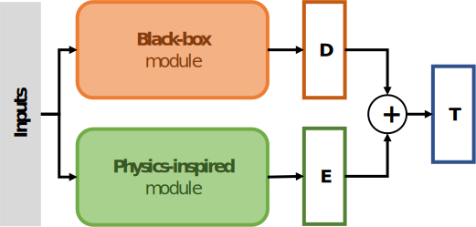

# Physically Consistent Neural Networks

This repository contains a clean and efficient version of Physically Consistent Neural Networks (PCNNs), where a physics-inspired module runs in parallel of a black-box one (neural networks) to capture physical effects.

## Installation

### Using pip

With a python version above 3.10, you can install it directly through PyPI with `pip install pcnns`.

### Local installation
After cloning the repository on your computer, go to the pcnn folder with `cd path_to_the_folder/pcnn`.  

The fastest way to run the code is to use `poetry`, which can be installed from [here](https://python-poetry.org/docs/#installation).  
You can then run `poetry install` to install all the required dependencies.  
Once the dependencies are installed, you can for example run jupyter-lab with `poetry run jupiter lab` or VS code with `poetry run code .`.

Alternatively, you can install requirements from `requirements.txt`.

## Related publications

__Physically Consistent Neural Networks for building thermal modeling: Theory and analysis__  
Loris Di Natale, Bratislav Svetozarevic, Philipp Heer, and Colin N. Jones  
_Applied Energy_ 325 (2022). 
https://doi.org/10.1016/j.apenergy.2022.119806  

__Towards Scalable Physically Consistent Neural Networks: an Application to Data-driven Multi-zone Thermal Building Models__  
Loris Di Natale, Bratislav Svetozarevic, Philipp Heer, and Colin N. Jones  
Submitted to _Applied Energy_ (2023).
https://arxiv.org/abs/2212.12380.

## Contact
For additional information, pleasae contact loris.dinatale@netplus.ch